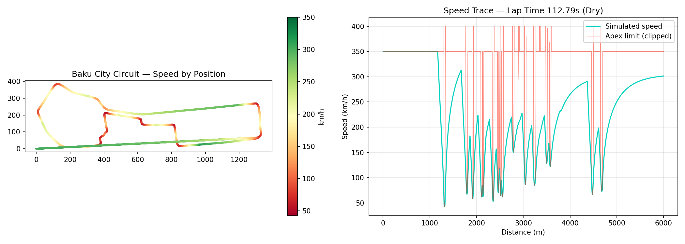

# F1 Vehicle Dynamics & Lap-Time Simulation

A point-mass lap-time simulator built from first-principles vehicle dynamics —
cornering-speed limits, friction-circle-bound traction and braking — extended
to a real circuit (Baku City Circuit) and calibrated to current (2026) FIA
technical regulations.



## What this is

A from-scratch reimplementation of the standard "quasi-steady-state,
point-mass" approach used in lap-time simulation tools: at every point along
the track, the car's speed is bounded by whichever is most restrictive —
how fast it can corner, how hard it can accelerate, or how late it can brake.

This isn't a full multi-body vehicle model (no suspension kinematics, no
independent front/rear load transfer) — it's the simplified model used for
quick, physically-grounded performance trade-off studies, built to understand
*why* the numbers move the way they do rather than to replicate lap times
exactly.

## Force model

**Cornering.** The centripetal force needed to hold a corner radius `R` at
speed `v` (`mv²/R`) has to come from tire friction. Available friction isn't
fixed — it scales with total vertical load, i.e. weight *plus* aerodynamic
downforce:

```
m·v² / R  =  μ · (m·g + ½·ρ·Cl·A·v²)
```

Solved for `v`, this gives the maximum speed the car can carry through a
given corner.

**Acceleration / braking — the friction circle.** Grip is a shared budget
between cornering and accelerating/braking, not two separate resources:

```
F_max        = μ · (m·g + downforce)
F_lateral    = m·v² / R
F_available  = √(F_max² − F_lateral²)      # left over for drive/brake force
```

A car right at its cornering limit has zero grip left over to accelerate —
which is exactly why real drivers straighten the wheel before getting back
on the throttle.

**Engine/power limit.** Drive force is also capped by available power
(`F = P / v`), so the car is traction-limited at low speed and power-limited
at high speed.

## Real-world parameters used

Rather than picking illustrative numbers, the vehicle model is built from
current FIA technical regulations:

| Parameter | Value | Source |
|---|---|---|
| Minimum mass | 768 kg | 2026 technical regulations |
| Power unit | ~400 kW ICE + ~350 kW MGU-K | 2026 hybrid power-unit split |
| MGU-K energy limit | 8.5 MJ / lap | energy-limited, not just power-limited |
| Aero modes | High-downforce (corner) / low-drag (straight) | 2026 active aerodynamics |
| Circuit | Baku City Circuit, 6.003 km, 20 turns | official FIA circuit data |

## Pipeline

1. **Parse real track geometry.** A traced SVG of the Baku City Circuit map
   is parsed (custom path parser handling `m`/`c`/`s`/`z` commands, cubic
   Bézier flattening) into a dense `(x, y)` polyline.
2. **Scale and resample.** The polyline is scaled to the official 6.003 km
   centreline length and resampled at a uniform 2 m arc-length spacing —
   this matters, because the physics integration assumes each step
   corresponds to a real, equal distance travelled.
3. **Curvature.** Corner radius at every point is computed via a 3-point
   circumradius fit (`R = abc / 4K`), using a widened point baseline to
   filter out sub-metre SVG-tracing noise without smoothing away real
   corners.
4. **Simulate.** Forward pass (acceleration-limited) and backward pass
   (braking-limited) integration, friction-circle-bound at every step, under
   configurable track conditions (temperature, weather, grip evolution).

## Sample results

| Condition | Lap time | Δ vs dry |
|---|---|---|
| Dry, rubbered track | 112.9 s | — |
| Damp (grip 0.9) | 129.4 s | +14.6% |
| Wet (grip 0.8) | 155.5 s | +37.7% |

Sensitivity analysis on the base model shows tire grip (μ) as the single
most influential parameter on lap time, ahead of mass, downforce, or drag —
consistent with how real setup work prioritizes mechanical grip and tire
management.

## Known limitations

Being upfront about what this model does *not* capture:

- **Geometric centreline, not the racing line.** Real drivers use the full
  track width to straighten corners, increasing effective radius. This model
  uses the track centreline, so it's a self-consistent but conservative
  (slower) estimate — not a calibrated lap-time replica.
- **No combined front/rear load transfer.** Braking, acceleration, and
  cornering load transfer are lumped into a single point mass rather than
  distributed across independently-modeled axles.
- **Illustrative tire-grip model.** The grip-vs-temperature and
  grip-vs-weather multipliers are simplified approximations, not derived
  from real tire data (which is proprietary to tire manufacturers and
  teams).
- **Single global length-scaling factor.** The traced SVG is scaled by one
  overall factor to match total circuit length, so individual straight/
  corner proportions may not perfectly match the real circuit even though
  total lap distance is correct.
- **Manual Override Mode (2026's DRS replacement)** is included as an
  optional, off-by-default toggle — it's only usable by a car attacking
  within 1 second of the car ahead, so a single-car lap doesn't normally
  trigger it.

## Running it

```bash
pip install numpy matplotlib
python baku_lap_sim.py
```

Requires `RaceCircuitGillesBaku.svg` (a traced outline of the circuit) in
the same directory. Outputs a lap time, a wet/dry/damp sensitivity summary,
and `baku_telemetry.png` (track map colored by speed + a speed-vs-distance
trace).

## Project structure

```
.
├── baku_lap_sim.py           # full simulation pipeline
├── RaceCircuitGillesBaku.svg # traced circuit outline (input)
└── baku_telemetry.png        # generated output plot
```
